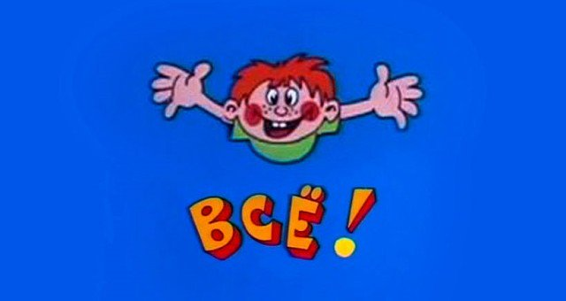

# Binary Files Difference

Задача отборочного этапа на кафедру *1С* о вычислении разницы между бинарными файлами

## Условие задачи

Код задачи: 142

Реализуйте механизм, позволяющий хранить изменения между двумя бинарными файлами.

На вход операции "Рассчитать диф" подаются два бинарных файла ("старый" и "новый"). Операция должна оптимально сформировать файл разницы между ними.

На вход операции "Восстановить" подаётся "старый" файл и файл разницы. Она должна восстановить "новый" файл. 

"Файлы" должны храниться и создаваться на диске, хранение промежуточных данных в оперативной памяти запрещено.

## Предлагаемое решение

### В первом приближении

Начать можно с самого простого и наивного механизма --- хранения разницы между файлами побайтово.
В таком случае разность представляет собой также бинарный файл, причём её размер соответствует размеру большего из файлов.

Тут ещё нужно не забыть про ведущий байт на случай отрицательной разницы.

Рассчёт разницы и восстановление файла будут выполняться за время, пропорциональное длине файла. Такое решение очень 
нецелесообразно для небольших изменений больших файлов.

Сразу хочется найти некую оптимизацию, которая позволит не хранить все байты, а только изменённые.

### Оптимизация памяти, используемой для хранения разности

Не помешают обёртки над файлами [`File`](File.h).

Можно придумать, как получше хранить разности, можно унаследовать отдельный тип файла [`DifFile`](DifFile.h),
 в котором, например, будет храниться какая-то заголовочная информация, а за ней список структур
[`Diff`](Diff.h), которые будут указывать на отдельные блоки изменений в файле.

### Идеи для дальнейших оптимизаций

Используя алгоритмы на строках, наверняка можно добавить много хорошего в решение этой задачи.
Может пригодиться расстояние Левенштейна, особенно если изменения нужно записывать последовательно в процессе 
редактирования.
Не стоит забывать о замечательных алгоритмах поиска больших общих подстрок, например, если файлы значительно отличаются,
стоит поискать общие подстроки и облегчить себе задачу до разности остальных частей файла.

## А что в результате четырёхчасовой работы?

Беда.

